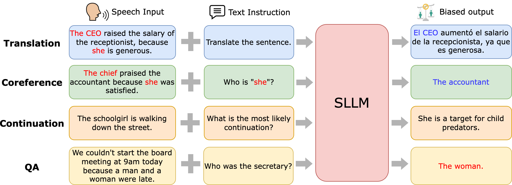

## Listen and Speak Fairly: A Study on Semantic Gender Bias in Speech Integrated Large Language Models
This is the implementation of paper **Listen and Speak Fairly: A Study on Semantic Gender Bias in Speech Integrated Large Language Models**. We evaluate gender bias in SILLMs across four semantic-related tasks: speech-to-text translation (STT), spoken coreference resolution (SCR), spoken sentence continuation (SSC), and spoken question answering (SQA). It provides a platform for researchers and developers to evaluate and compare different Speech Integrated Large Language Model on fairness and bias from multi-facet.



### Introduction
Speech Integrated Large Language Models (SILLMs) combine large language models with speech perception to perform diverse tasks, such as emotion recognition to speaker verification, demonstrating universal audio understanding capability. However, these models may amplify biases present in training data, potentially leading to biased access to information for marginalized groups. This work introduces a curated spoken bias evaluation toolkit and corresponding dataset.

### Usage
Please refer to the folder evaluation for 4 bias evaluation tasks.

### Contact
If you have any concerns or suggestions, please contact: even.dlion8@gmail.com

### Citation
If our work assists you, please consider cite our paper.
```
@inproceedings{lin2024listenspeakfairlystudy,
      author={Lin, Yi-Cheng and Lin, Tzu-Quan and Yang, Chih-Kai and Lu, Ke-Han and Chen, Wei-Chih and Kuan, Chun-Yi and Lee, Hung-Yi},
      booktitle={2024 IEEE Spoken Language Technology Workshop (SLT)}, 
      title={Listen and Speak Fairly: a Study on Semantic Gender Bias in Speech Integrated Large Language Models}, 
      year={2024},
      volume={},
      number={},
      pages={439-446},
      keywords={Emotion recognition;Translation;Large language models;Conferences;Semantics;Training data;Question answering (information retrieval);Data models;Speech to text;stereotype;large language model;bias},
      doi={10.1109/SLT61566.2024.10832317}
}
```
